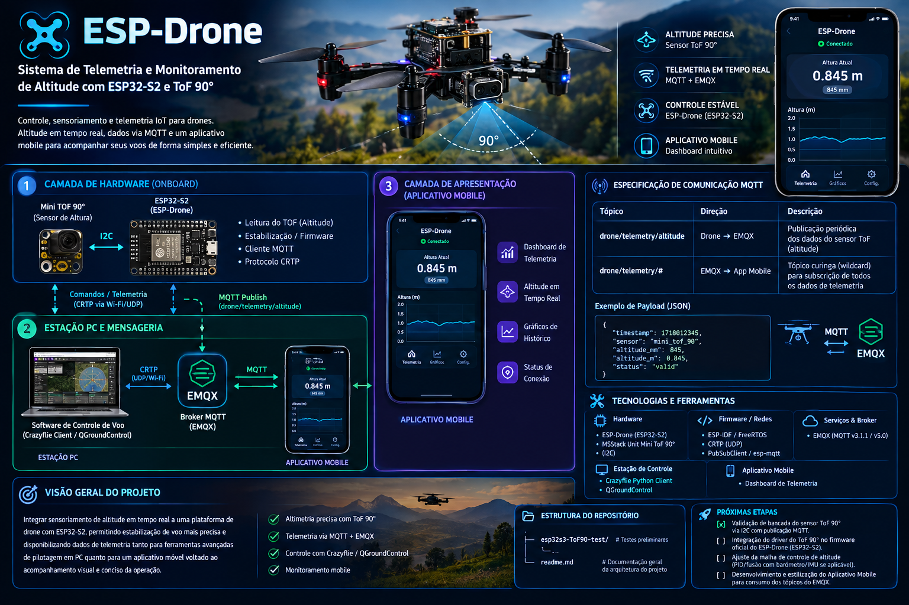

# ESP-Drone: Sistema de Telemetria e Monitoramento de Altitude com ESP32-S2 e ToF 90°

Sistema integrado de controle, sensoriamento e telemetria IoT para veículos aéreos não tripulados (drones). O projeto utiliza a plataforma de código aberto **ESP-Drone** baseada no SoC **ESP32-S2**, integrado ao sensor de distância **Unit Mini ToF 90°** para medição precisa de altitude, broker **EMQX** para distribuição de telemetria em tempo real e um **aplicativo mobile** dedicado para monitoramento conciso dos voos.

---

## 📌 Visão Geral do Projeto

O objetivo principal deste projeto é integrar sensoriamento de altitude em tempo real a uma plataforma de drone com ESP32-S2, permitindo estabilização de voo mais precisa e disponibilizando dados de telemetria tanto para ferramentas avançadas de pilotagem em PC quanto para um aplicativo móvel voltado ao acompanhamento visual e conciso da operação.

A arquitetura do sistema divide-se em três pilares principais:
1. **Controle e Sensoriamento no Drone (Hardware):** Leitura de altitude pelo sensor Time-of-Flight (Mini ToF 90°) via I2C, fusão com a malha de estabilização do firmware ESP-Drone e transmissão simultânea via protocolo de controle (CRTP) e mensagens MQTT.
2. **Infraestrutura e Estação de Solo:** Comunicação direta com software de pilotagem (Crazyflie Client / QGroundControl) e despacho de telemetria para o broker MQTT **EMQX**.
3. **Apresentação e Telemetria Móvel:** Aplicativo mobile conectado ao EMQX que assina os tópicos de telemetria e exibe painéis intuitivos de altitude, histórico e status de conectividade.

---

## 🏗️ Arquitetura do Sistema

```
+-------------------------------------------------------------------------------+
|                                CAMADA DE HARDWARE                             |
|                                                                               |
|  +--------------------+      I2C      +---------------------------------+     |
|  |   Mini TOF 90°     | ------------> |       ESP32-S2 (ESP-Drone)      |     |
|  |  (Sensor Altura)   |               |                                 |     |
|  +--------------------+               | - Leitura do TOF (Altitude)     |     |
|                                       | - Estabilização / Firmware      |     |
|                                       | - Cliente MQTT & Protocolo CRTP |     |
|                                       +---------------------------------+     |
+---------------------------------------/----------------\----------------------+
                                       /                  \
              Comandos / Telemetria   /                    \ MQTT Publish
                   (CRTP via Wi-Fi/UDP)                      \ (drone/telemetry/altitude)
                                     /                      \
+-----------------------------------|------------------------|------------------+
|                                  v                         v                  |
|                        +-------------------+     +-------------------+        |
|                        | Software de       |     |       EMQX        |        |
|                        | Controle de Voo   |     |   (MQTT Broker)   |        |
|                        | (Crazyflie Client |     |                   |        |
|                        | / QGroundControl) |     +---------|---------+        |
|                        +-------------------+               |                  |
|                                                            |                  |
|                                  ESTAÇÃO PC                |                  |
+------------------------------------------------------------|------------------+
                                                             |
                                               Wi-Fi / MQTT  | Sub: drone/telemetry/#
                                                             v
+-------------------------------------------------------------------------------+
|                              CAMADA DE APRESENTAÇÃO                           |
|                                                                               |
|                   +---------------------------------------+                   |
|                   |           Aplicativo Mobile           |                   |
|                   |                                       |                   |
|                   | - Dashboard de Telemetria             |                   |
|                   | - Exibição de Altitude em Tempo Real  |                   |
|                   | - Gráficos e Status de Conexão        |                   |
|                   +---------------------------------------+                   |
+-------------------------------------------------------------------------------+
```

---
## ⚡ Diagrama Elétrico Geral do Drone

```
       +-----------------------+
       |   Bateria LiPo 1S     |
       |  (3.7V / 300-600mAh)  |
       +-----------+-----------+
                   |
                   +------------------------------------+
                   |                                    |
                   v                                    v
       +-----------------------+            +-----------------------+
       |     Regulador LDO     |            |  Drivers / MOSFETs    |
       |     (3.7V -> 3.3V)    |            |   Motores do Drone    |
       +-----------+-----------+            +-----------+-----------+
                   |                                    |
                   | (3.3V Estabilizado)                | (Alimentação Direta)
                   v                                    v
      +-------------------------+              +------------------+
      |  ESP32-S2 (MCU Core)    |              | Motores M1 - M4  |
      +------------+------------+              +------------------+
                   |
            Barramento I2C
                   |
                   v
      +-------------------------+
      |     Mini TOF 90°        |
      |   (Medição Altitude)    |
      +-------------------------+
```

---

## ⚡ Esquema Elétrico do Circuito
```

                       +-----------------------------------+
                       |        ESP32-S2 (ESP-Drone)       |
                       |                                   |
                       |  [3V3]  [GND]   [GPIO8]  [GPIO9]  |
                       +---|-------|--------|--------|-----+
                           |       |        |        |
                           |       |       SDA      SCL
                           |       |        |        |
 +-------------------+     |       |        |        |
 |   Mini TOF 90°    |     |       |        |        |
 |                   |     |       |        |        |
 |  [VCC]  [GND]     | <---+       |        |        |
 |    |      |       |             |        |        |
 |    +------+-------|-------------+        |        |
 |                   |                      |        |
 |  [SDA]------------|----------------------+        |
 |  [SCL]------------|-------------------------------+
 |                   |
 +-------------------+
```


## 🔍 Detalhamento das Camadas

### 1. Camada de Hardware (Onboard)
* **ESP32-S2 (ESP-Drone):** Responsável por executar os algoritmos de controle de atitude, estabilização de voo, geração de sinais PWM para os motores e gerenciamento das tarefas de rede. Implementa simultaneamente uma pilha UDP para o protocolo CRTP e um cliente MQTT leve.
* **Sensor Unit Mini ToF 90°:** Módulo sensor de distância óptico por tempo de voo com amplo campo de visão (FOV de 90°). Conectado ao ESP32-S2 via barramento **I2C**, mede continuamente a distância do drone em relação ao solo/obstáculos com alta precisão e baixa sensibilidade a variações de iluminação ambiente.

### 2. Estação PC e Mensageria
* **Software de Controle de Voo:** Interface de comando de baixo nível e sintonia (Crazyflie Client ou QGroundControl) comunicando via **CRTP (Crazy RealTime Protocol)** sobre Wi-Fi/UDP. Permite controle manual por joystick, calibração de PID e diagnóstico operacional direto.
* **Broker EMQX:** Servidor de mensagens MQTT escalável e de baixa latência responsável por receber os pacotes de telemetria publicados pelo drone (`drone/telemetry/altitude`) e encaminhá-los de maneira desacoplada aos clientes inscritos.

### 3. Camada de Apresentação (Aplicativo Mobile)
* **Aplicativo Mobile:** Desenvolvido para fornecer uma experiência visual simplificada e objetiva ao operador em solo.
  * Conecta-se ao broker EMQX e assina o tópico de telemetria global (`drone/telemetry/#`).
  * Exibe em tempo real a altitude atual em centímetros/metros.
  * Apresenta gráficos de linha com a evolução temporal da altitude.
  * Sinaliza o estado da conexão MQTT e eventuais alertas de perda de telemetria.

---

## 📡 Especificação de Comunicação MQTT

### Tópicos
| Tópico | Direção | Descrição |
| :--- | :--- | :--- |
| `drone/telemetry/altitude` | Drone ➔ EMQX | Publicação periódica dos dados do sensor ToF (altitude) |
| `drone/telemetry/#` | EMQX ➔ App Mobile | Tópico curinga (wildcard) para subscrição de todos os dados de telemetria |

### Exemplo de Payload (JSON)
```json
{
  "timestamp": 1718012345,
  "sensor": "mini_tof_90",
  "altitude_mm": 845,
  "altitude_m": 0.845,
  "status": "valid"
}
```

---

## 🛠️ Tecnologias e Ferramentas

* **Hardware:**
  * Drone: ESP-Drone baseado no SoC Espressif ESP32-S2
  * Sensor: M5Stack Unit Mini ToF 90° (Comunicação I2C)
* **Firmware / Redes:**
  * ESP-IDF / FreeRTOS
  * Protocolo CRTP (Crazy RealTime Protocol via UDP)
  * Cliente MQTT (PubSubClient / esp-mqtt)
* **Serviços & Broker:**
  * EMQX Broker (MQTT v3.1.1 / v5.0)
* **Estação de Controle & Apresentação:**
  * Crazyflie Python Client / QGroundControl
  * Aplicativo Mobile (Dashboard de Telemetria)

---

## 📁 Estrutura do Repositório

```text
.
├── esp32s3-ToF90-test/    # Testes preliminares de validação do sensor ToF 90° e MQTT
├── readme.md              # Documentação geral da arquitetura do projeto
└── ...
```

---

## 🚀 Próximas Etapas

- [x] Validação de bancada do sensor ToF 90° via I2C com publicação MQTT.
- [ ] Integração do driver do ToF 90° no firmware oficial do ESP-Drone (ESP32-S2).
- [ ] Ajuste da malha de controle de altitude (PID/fusão com barômetro/IMU se aplicável).
- [ ] Desenvolvimento e estilização do Aplicativo Mobile para consumo dos tópicos do EMQX.
